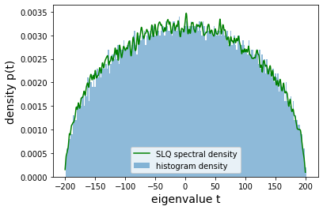

# SciTorch

This library is intended to be a lightweight utility for quick experimentation in PyTorch.

A first step was to recreate the [Stochastic Lanczos Quadrature](https://shashankaubaru.github.io/Papers/Lanc_Quad.pdf) (based on [Gaussian quadrature rules](https://www.ams.org/journals/mcom/1969-23-106/S0025-5718-69-99647-1/S0025-5718-69-99647-1.pdf)) to estimate the Spectral Eigenvalue Density of a Matrix.

As an example we can compute the spectral density of a symmetric, Hermitian matrix $A=A^T$, resulting in  [Wigner's Semicircle Law](https://mathworld.wolfram.com/WignersSemicircleLaw.html)



The code generate this plot is simply

```python
from scitorch.lanczos import stochastic_lanczos_quadrature, spectral_density_estimation
import torch
import numpy as np
import matplotlib.pyplot as plt

%matplotlib inline

D = 5000
A = torch.randn(D, D)
A = A + A.T
Avp = lambda v: A @ v 

nodes, weights = stochastic_lanczos_quadrature(Avp, D, 500, 40, True)

bins = np.linspace(-200, 200, 201)
w=bins[1]-bins[0]
cnt, edges = np.histogram(np.linalg.eigvalsh(A.data.numpy()), bins=bins)

plt.plot(x, spec, c='g', label='SLQ spectral density')
plt.bar(edges[1:], cnt/(w * cnt.sum()), width=w, alpha=0.5, label='histogram density')
plt.legend()
plt.xlabel('eigenvalue t', fontsize=14)
plt.ylabel('density p(t)', fontsize=14)
```